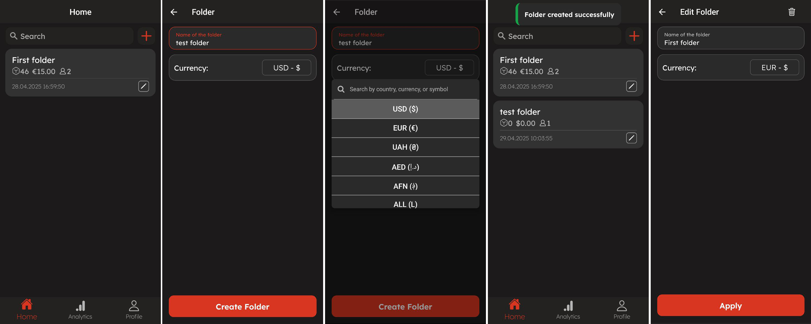

# 📦 EverStock – Cross-Platform Inventory Management App

**EverStock** is a mobile inventory management system built with **React Native**, designed to offer real-time control over stock data without requiring a custom backend or infrastructure.

Powered by **Supabase** (PostgreSQL + Row-Level Security) and **Clerk** for authentication, the app provides secure multi-user collaboration, product tracking, analytics, and export — all optimized for Android and iOS.

It is aimed at individuals, small teams, and micro-businesses who need a fast, extensible, and self-contained solution to manage their stock without relying on complex ERP or WMS systems.

---

## 🎥 Demo Video

▶️ **[Click here to watch the demo on YouTube](https://www.youtube.com/watch?v=Y9T3hE1a6ls)**

> The video shows puzzle setup, solving with each algorithm, parallel solving in Together mode, and the results dashboard.

---

## 🖼️ UI Previews

| Warehouse List & Editing | Item List & Settings |
|--------------------------|----------------------|
|  |  |

| Team Member Management | Warehouse Analytics & Item History |
|------------------------|------------------------------------|
|  |  |

---

## 🧩 Tech Stack

| Layer             | Technology                                   |
|------------------|----------------------------------------------|
| **Frontend**      | React Native + Expo                         |
| **Auth**          | Clerk (Email/Google login)                  |
| **Backend**       | Supabase (PostgreSQL, Row-Level Security)   |
| **Styling**       | Tailwind CSS (via NativeWind)               |
| **Typing**        | TypeScript                                  |
| **State**         | Zustand, React Context                      |
| **Data Fetching** | TanStack Query                              |

---

## ✨ Features

- 🔐 **Secure Login** – Sign in with email or Google via Clerk
- 🗂️ **Multi-Warehouse Support** – Organize multiple storage spaces with custom currencies
- 📦 **Advanced Product Management** – Add photos, descriptions, min quantities, and pricing
- ⚡ **Fast Edit Mode** – Update stock levels instantly using +/– or keyboard
- 🔔 **Low Stock Alerts** – Visual indicators and filters for items below minimum
- 📈 **Analytics** – Graphs, dashboards, and historical tracking
- 🕒 **Change History** – Full audit log for each product and user
- 👥 **Team Access Control** – Invite users and assign granular roles
- 📤 **Export** – Download data as CSV or JSON
- 🎨 **Dark / Light Theme** (planned)
- 🌍 **Multilingual UI** (planned)
- 📶 **Offline Support** (planned)
- 📷 **Barcode Scanning** (planned)

---

## 📦 Installation

Make sure you have **Node.js** and **Expo CLI** installed:

```bash
npm install -g expo-cli
```

Clone the repository and install dependencies:

```bash
git clone https://github.com/your-username/everstock.git
cd everstock
npm install
npx expo start
```

You can now run the app on an emulator or real device (via Expo Go).

---

## 🔐 Environment Setup

Before running the app, create a `.env` file in the root of the project and add the following:

```env
EXPO_PUBLIC_SUPABASE_URL=https://your-project.supabase.co
EXPO_PUBLIC_SUPABASE_ANON_KEY=your-anon-key
EXPO_PUBLIC_CLERK_PUBLISHABLE_KEY=your-clerk-pk
```
---

## 📌 Roadmap

- [x] MVP with warehouse/product management
- [x] Analytics & history tracking
- [x] Role-based access control
- [ ] Barcode scanning (🔜)
- [ ] Offline mode
- [ ] Multilingual support
- [ ] Web dashboard for managers

---

## 🤝 Contributing

Feel free to fork the project and submit a pull request.

If you have suggestions, bugs, or feature requests, open an issue or contact me.

---

## 📜 License

This project is open-source under the **MIT License**.

---

## 👤 Author

Developed by [Vadym Brovych](mailto:vadmabos.programming@gmail.com)
🗓️ Original development: May 2024
